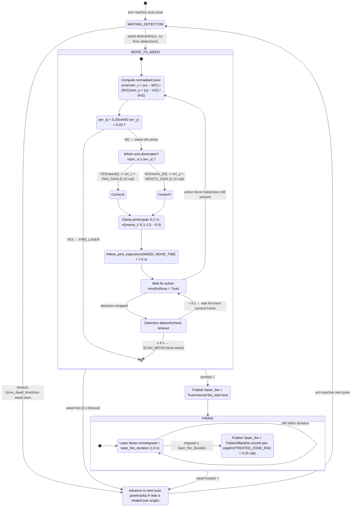

# Weed-Centering Control Loop — State Machine

State machine for error correction once the camera identifies a weed. The arm iterates a pixel-error correction loop, adjusting one joint axis per tick, until the weed is centred under the camera, then fires the laser.

## Control loop parameters

| Parameter | Value | Role |
|---|---|---|
| `FIRE_ZONE_FRAC` | 0.20 | Dead-zone threshold — fires when weed is within 20% of image centre |
| `PAN_GAIN` | 0.10 rad/px | Correction step size for X-axis (`shoulder_pan`) |
| `WRIST2_GAIN` | 0.10 rad/px | Correction step size for Y-axis (`wrist_2`) |
| `WEED_MOVE_TIME` | 1.0 s | Duration of each correction move |
| `WEED_LOCK_TIMEOUT` | 8.0 s | Give up on lost weed after this long |
| `TREATED_ZONE_RAD` | 0.25 rad | Blacklist radius around a fired pan angle |

## Why single-axis correction per tick

`shoulder_pan` rotation shifts the image in both X and Y, so correcting both axes simultaneously creates a coupled feedback loop that can diverge. Correcting only the dominant error axis per step decouples the loop and ensures convergence.

## Source

Implemented in [`src/watermelon_demo/watermelon_demo/arm_controller_node.py`](../src/watermelon_demo/watermelon_demo/arm_controller_node.py), `State.MOVE_TO_WEED` branch of `_tick()`.
