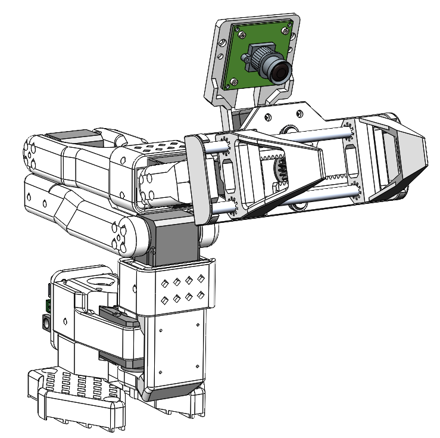
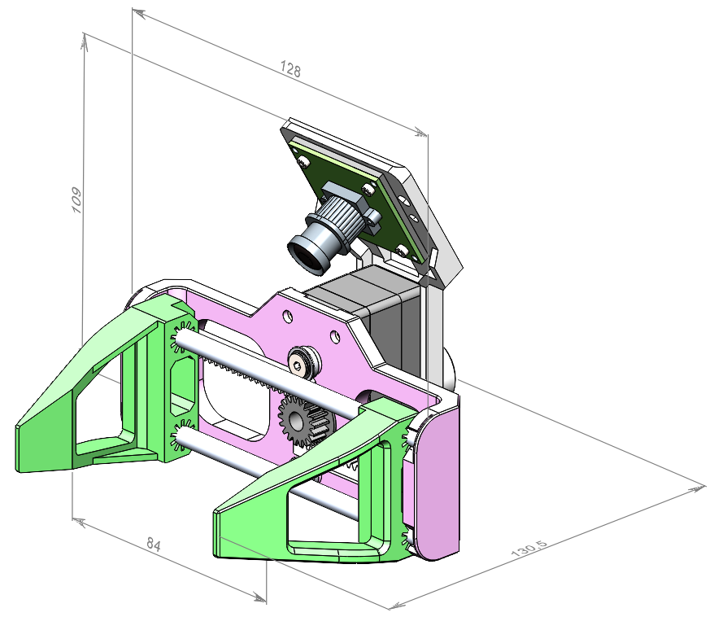
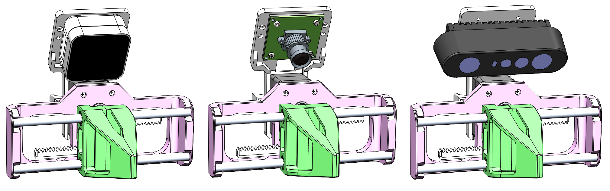
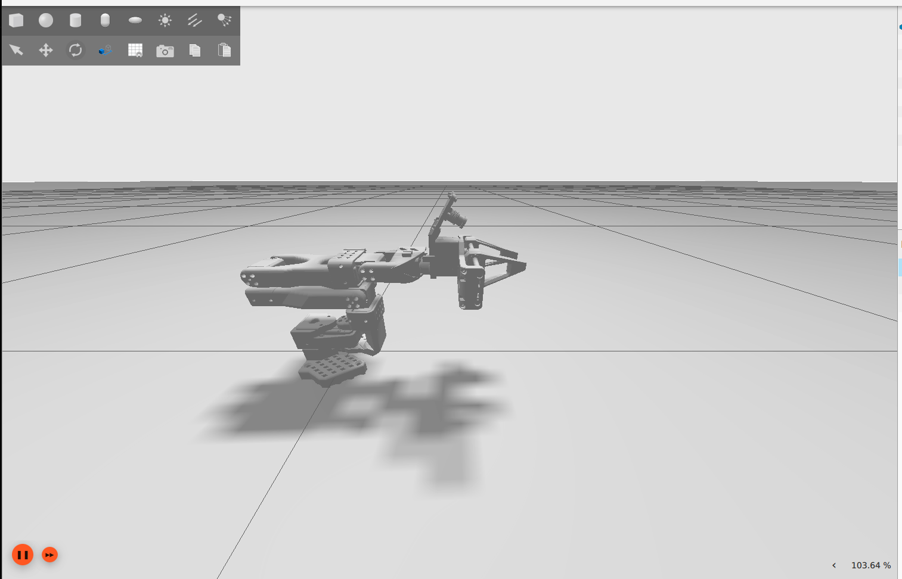
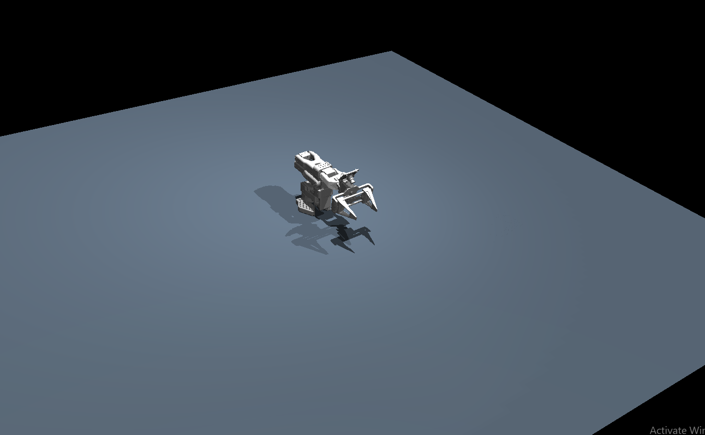

# SO-ARM100/101 Parallel Gripper

<div align="center">

[](https://youtube.com/shorts/bSyXjgNGXZk)

**🎥 [Watch the gripper in action!](https://youtube.com/shorts/bSyXjgNGXZk)**

A lightweight 3D-printed parallel gripper designed by **[Robonine](https://robonine.com)** for the open-source SO-ARM100/101 robotic platform.

[](LICENSE)
[](docs/bom.md)
[](docs/assembly-guide.md)

---

**Questions? We're here to help!**
📩 Email: [hello@robonine.com](mailto:hello@robonine.com)

</div>

---

## ✨ Key Features

| Feature | Description |
|---------|-------------|
| **120N Gripping Force** | Reliable parallel jaw mechanism |
| **14 mm/s Speed** | Gripper operation speed |
| **84mm Full Stroke** | Wide opening for various objects |
| **0.5mm Repeatability** | High precision positioning |
| **Camera Compatible** | Supports RealSense, Orbbec, USB cameras |
| **3D Printable** | All parts print on standard FDM printers |
| **~$62 Total Cost** | Affordable open-source solution |
| **Easy Assembly** | 30-45 minutes with basic tools |

---

## 📸 Gallery

<div align="center">

### Gripper on SO-ARM101



*Follower gripper integrated with SO-ARM101 robot arm*

### Dimensions



*128 × 109 × 130.5 mm, full stroke 84 mm*

</div>

---

## 📋 Specifications

### Gripper Parameters

| Parameter | Value |
|-----------|-------|
| Maximum gripping force | **120 N** |
| Maximum gripping speed | **14 mm/s** |
| Full stroke | **84 mm** |
| Repeatability | **0.5 mm** |
| Assembly mass (PLA, 30% infill) | **170 g** |
| DOF | **1** |

### Dimensions

| Dimension | Value |
|-----------|-------|
| Width | 128 mm |
| Depth | 130.5 mm |
| Height | 109 mm |

### Servo Parameters (Feetech STS3215)

| Parameter | Value |
|-----------|-------|
| Operating Voltage | 12V |
| Stall torque | 30 kg·cm |
| Speed (no load) | 45 RPM |
| Encoder | Absolute magnetic 12-bit |
| Protocol | RS485/TTL up to 1 Mbps |
| Operating temperature | -20°C ~ 60°C |

---

## 📷 Camera Compatibility

The gripper supports multiple cameras via interchangeable camera holder:

| Camera | Type | Use Case |
|--------|------|----------|
| IMX335 5MP USB | RGB | Basic vision tasks |
| GC2093 2MP USB | RGB | Budget option |
| Orbbec Gemini 2 | RGB-D | 3D perception |
| RealSense D405 | RGB-D | Close-range depth |
| RealSense D435/D435i | RGB-D | General purpose |
| RealSense D455 | RGB-D | Long-range depth |

<div align="center">



*RealSense, USB camera module, Orbbec Gemini 2*

</div>

---

## 💰 Bill of Materials

**Total Cost: ~$62** ([Full BOM with Amazon links](docs/bom.md))

| Category | Components | Est. Cost |
|----------|------------|-----------|
| Electronics | Feetech STS3215 Servo + Servo Bus Adapter | ~$40 |
| Bearings | MF106ZZ (x2) | ~$2 |
| Aluminium/Carbon Tubes | D6x1×125mm (x2) | ~$4 |
| 3D Printing | 8 parts (~100-150g PLA) | ~$12 |
| Fasteners | M2/M4 screws, M2 nuts, M3 set screws | ~$3 |

---

## 🚀 Quick Start

### 1. Print the Parts (2-4 hours)

Download STL files from [`models/parts/`](models/). Compatible with popular printers like **Bambu Lab A1 mini**, **Prusa MINI+**, and any printer with ≥180×180mm bed.

| Part | Qty | Settings |
|------|:---:|----------|
| Main frame (RB9.01.062.010) | 1 | 20% infill |
| Clamp (RB9.01.062.020) | 2 | 20% infill |
| Gear rack (RB9.01.062.030) | 2 | 30% infill |
| Gear (RB9.01.062.040) | 1 | 30% infill |
| Camera holder (RB9.01.060.074) | 1 | 20% infill |
| Holder (RB9.01.060.080) | 1 | 20% infill |
| Camera Spacer (RB9.01.060.090) | 1 | 20% infill |

### 2. Order Components (1-2 days)

See [Bill of Materials](docs/bom.md) for direct Amazon links.

### 3. Assemble (30-45 minutes)

Follow the [Assembly Guide](docs/assembly-guide.md) with step-by-step images:

1. Mount gear on servo disc, install this assembly on servo
2. Insert servo cable
3. Using Feetech software move servo to its minimal position (move the slider in the software to the left)
4. Attach gear racks to clamps
5. Inserts the rods into both clamps
6. Install bearings on main frame and fix with srews
7. Snap the rods into the frame
8. Spread the clamps to the extreme positions on the left and right
9. Insert servo and fix it with screws
10. Attach Camera Spacer and UVC camera, fix with 4x screws and nuts M2 (optional)
11. Mount to robot arm (optional)

### 4. Software Setup

```bash
# Install STServo SDK
git clone https://github.com/FEETECH-RC/STServo_SDK_Python.git

# Install dependencies
pip install pyserial

# Run gripper control
python software/python/gripper_control.py
```

---

## 📁 Repository Structure

```
├── assets/
│   └── images/
│       ├── assembly/          # Assembly step images
│       └── specification/     # Technical drawings
├── docs/
│   ├── assembly-guide.md                # Step-by-step assembly
│   ├── bom.md                           # Bill of materials with links
│   ├── Parallel gripper by Robo9.pdf    # Gripper product specification
│   ├── quick-start.md                   # Getting started guide
│   ├── SO-ARM101 by Robo9.pdf           # SO-ARM101 product specification
│   └── specifications.md               # Technical specifications
├── models/
│   ├── parts/                              # Individual STL files
│   └── Follower_Gripper_180x180_BedSize.STL  # Complete assembly (180×180mm bed)
├── simulation/
│   ├── README.md                  # Simulation overview
│   ├── gazebo/                    # Gazebo guide
│   ├── mujoco/                    # MuJoCo guide
│   ├── webots/                    # Webots guide
│   ├── coppeliasim/               # CoppeliaSim guide
│   ├── isaac_sim/                 # Isaac Sim guide
│   └── so_arm_101_description/    # ROS2 package (URDF, launch, Docker)
├── software/
│   └── python/                # Control software
└── examples/                  # Usage examples
```

---

## 📖 Documentation

| Document | Description |
|----------|-------------|
| [Quick Start Guide](docs/quick-start.md) | Get running in 30 minutes |
| [Assembly Guide](docs/assembly-guide.md) | Step-by-step with images |
| [Bill of Materials](docs/bom.md) | Parts list with Amazon links |
| [Specifications](docs/specifications.md) | Technical details |
| [3D Models](models/README.md) | Print settings and files |
| [Parallel Gripper Product Spec (PDF)](docs/Parallel%20gripper%20by%20Robo9.pdf) | Parallel gripper product specification by Robo9 |
| [SO-ARM101 Product Spec (PDF)](docs/SO-ARM101%20by%20Robo9.pdf) | SO-ARM101 robot arm product specification by Robo9 |

---

## 🔧 Hardware Requirements

### Electronics
- 1× Feetech STS3215 Servo Motor
- 1× Bus Servo Adapter Board (Waveshare)

### Mechanical
- 2× MF106ZZ Bearings (6×10×3 mm)
- 2× Aluminium/Carbon Tubes D6x1×125 mm

### Fasteners
- 2× M4×8 DIN 7991 screws
- 4x M2x8 DIN 912 screws
- 4× M2 DIN 934 nuts
- 4× M3×4 DIN 913 set screws

### Tools Required
- Phillips head screwdriver (PH1)
- Hex keys M2 (H1.5) and M4 (H2.5)

---

## 🖥️ Simulation

The SO-ARM101 can be simulated in 5 physics engines using a ROS2 description package with a single parameterized URDF. No ROS2 installation required -- Docker handles everything.

<div align="center">

| Gazebo (Ignition Fortress) | MuJoCo |
|:-:|:-:|
|  |  |

</div>

| Simulator | Status | Docker |
|-----------|--------|--------|
| [Gazebo](simulation/gazebo/README.md) | Ready | `docker compose run gazebo` |
| [MuJoCo](simulation/mujoco/README.md) | Ready | `docker compose run mujoco` |
| [Webots](simulation/webots/README.md) | Unstable | `docker compose run webots` |
| [CoppeliaSim](simulation/coppeliasim/README.md) | Not tested | External simulator |
| [NVIDIA Isaac Sim](simulation/isaac_sim/README.md) | Not tested | External simulator |

**Quick start (Docker):**

```bash
cd simulation/so_arm_101_description
docker compose run gazebo    # or mujoco, webots
```

See the [Simulation Guide](simulation/README.md) for full setup, architecture details, and robot commanding.

---

## 🤝 Contributing

We welcome contributions! Please feel free to:
- 🐛 Report bugs and issues
- 💡 Suggest new features
- 🔧 Submit pull requests
- 📖 Improve documentation

---

## 📄 License

This project is licensed under the GPL-3.0 License - see the [LICENSE](LICENSE) file for details.

---

## 🔗 Links

- [Feetech STS3215 Servo](https://www.feetechrc.com/525603.html)
- [Waveshare Bus Servo Adapter](https://www.waveshare.com/bus-servo-adapter-a.htm)
- [STServo Python SDK](https://github.com/FEETECH-RC/STServo_SDK_Python)

---

## 👥 Engineering Team

| Name | Role | Contact |
|------|------|---------|
| **Boris Kotov** | Software Engineer | [Telegram](https://t.me/bkotov) |
| **Alan Subin** | Design Engineer | [LinkedIn](https://www.linkedin.com/in/alan-subin/) |

---

<div align="center">

**Built for the robotics community by [Robonine](https://robonine.com)** 🤖

**Questions? We're here to help!**
📩 Email: [hello@robonine.com](mailto:hello@robonine.com)

</div>
