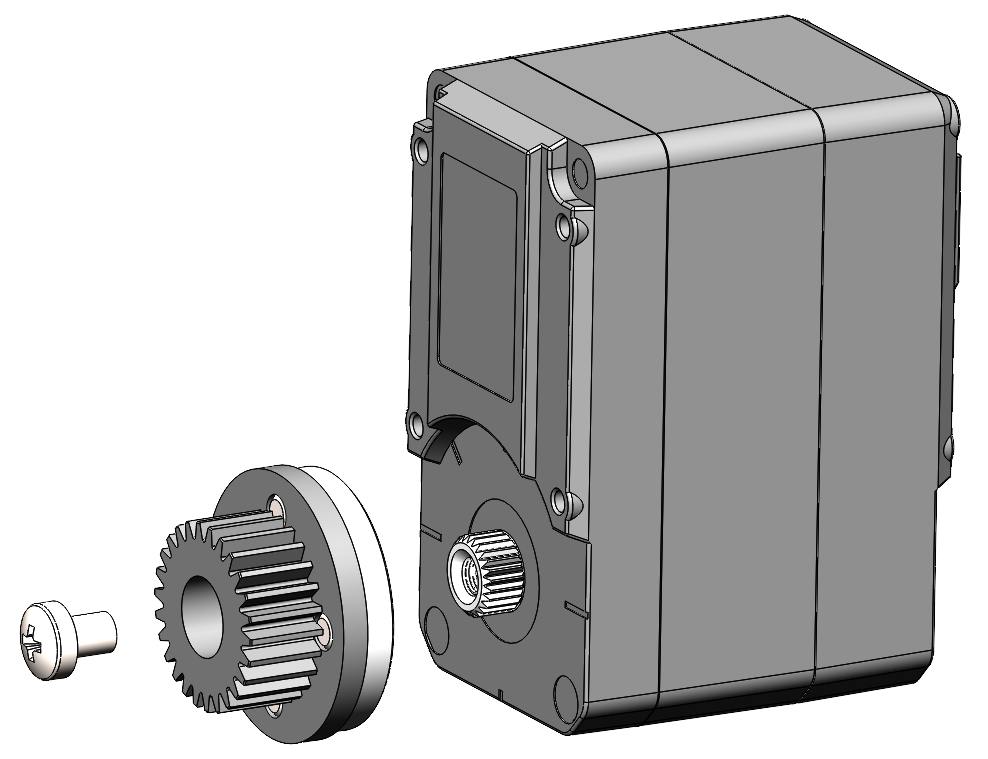
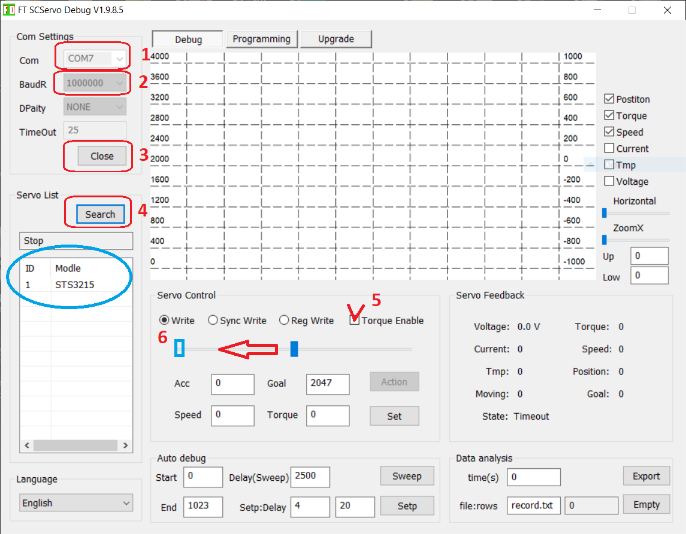
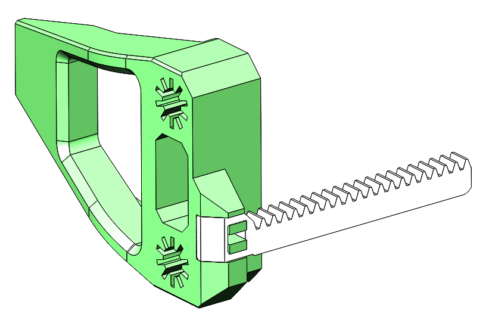
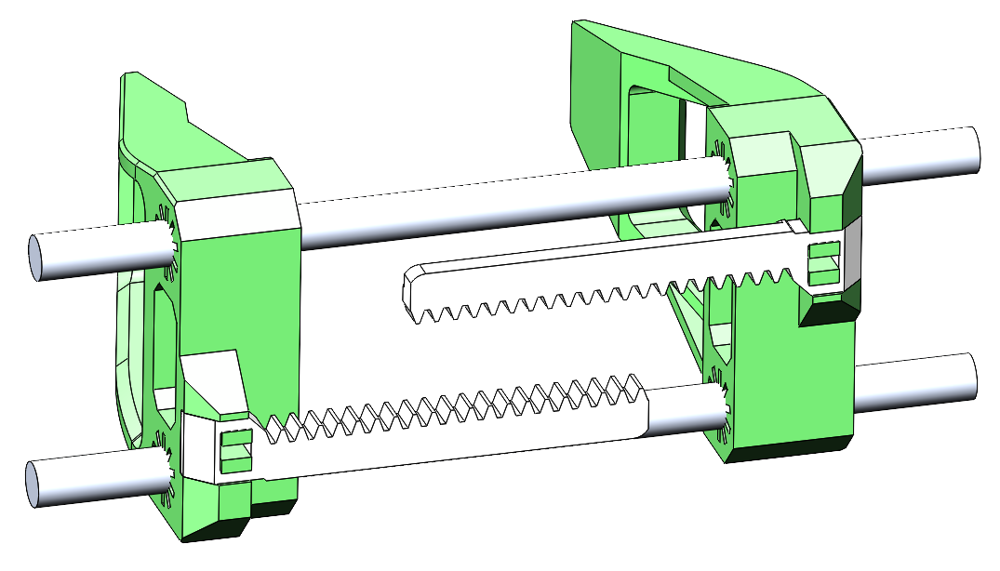
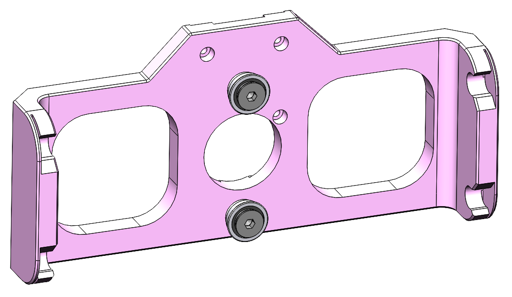
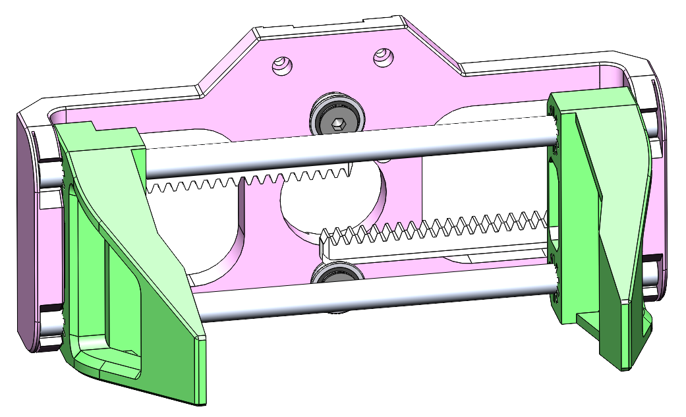
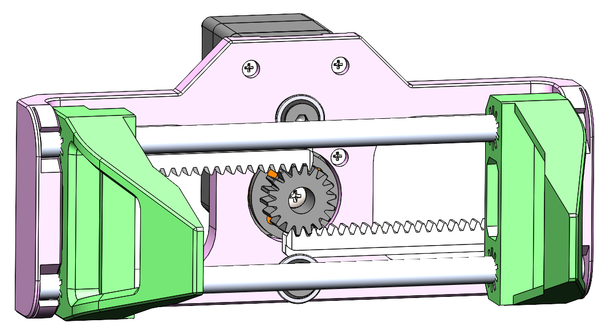
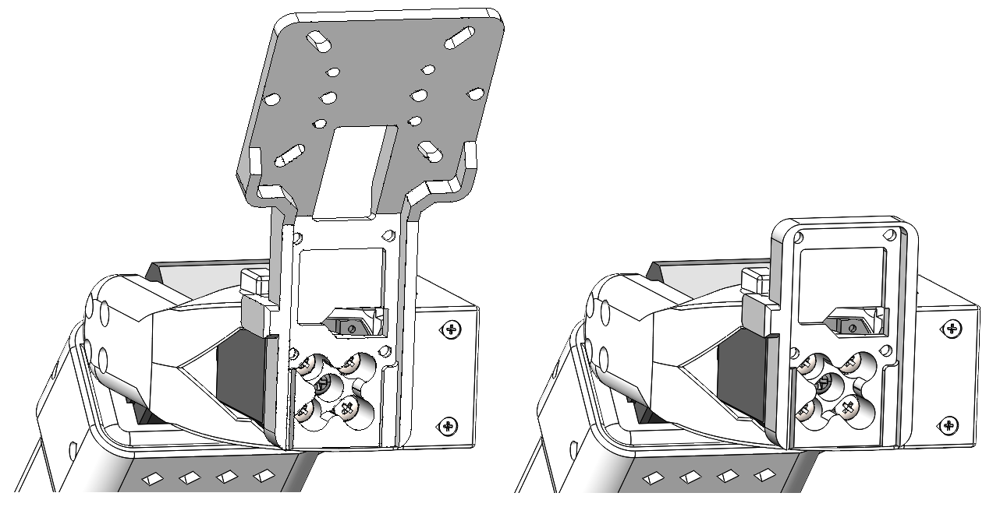
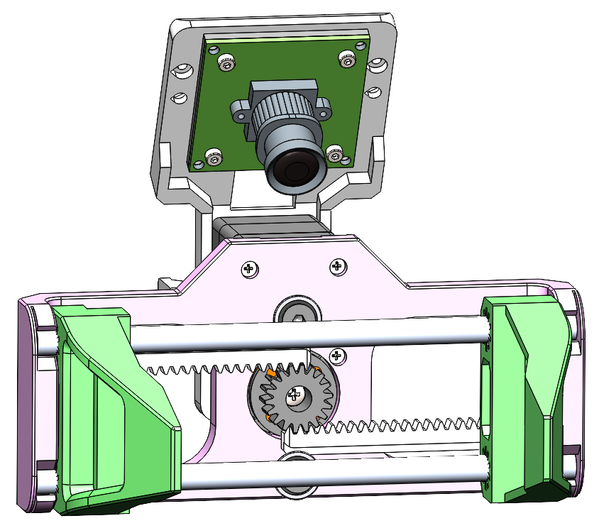

# Assembly Guide for Follower Gripper SO-ARM101

This guide provides step-by-step instructions for assembling the parallel gripper. Follow these steps carefully to ensure proper operation.

## Required Tools

- Phillips head screwdriver PH1
- Hex keys M2 (H1.5) and M4 (H2.5)

---

## Step 1: Install Gear on Servo

**Components needed:**
- 1x Feetech STS3215 Servo
- 1x Gear  (RB9.01.062.040)
- 1x Servo disk (from servo kit)
- 1x Servo mounting screw M3x6 (from servo kit)
- 4x Set Screw DIN 913 M3x4

**Instructions:**
1. Place Gear for Gripper on Servo disk and tighten 4x Set Screws M3x4 in the direction from Servo disk to Gear. Make sure that no gap appears between Disk and Gear when tightening the screws.
2. Mount the gear assembly onto the servo output shaft.
3. Secure with the screw M3x6 provided in the servo kit.

---

## Step 2: Servo Positioning

**Components needed:**
- 1x Serial Bus Servo Board and Cables

**Instructions for Windows users:**
1. Connect Servo to Serial Bus Servo Board, connect Board to PC by USB.
2. Run FD.exe from [`software/python/`](../software/).
3. Choose your COM port, select BaudRate 1 000 000, push buttons "Open" and after "Search".
4. Below from the list select your servo.
5. Check the box to enable torque on servo.
6. Move the slider to the left.

---

## Step 3: Clamps

**Components needed:**
- 2x Clamps (RB9.01.062.020)
- 2x Gear racks (RB9.01.062.030)

**Instructions:**
1. Attach gear racks to clamps.

---

## Step 4: Rods

**Components needed:**
- 2x Rods D6x125mm

**Instructions:**
1. Insert the rods into both clamps. If you ordered rods/tubes longer than 125 mm you need to cut them to this length.

---

## Step 5: Install Bearings on Main Frame

**Components needed:**
- 2x MF106ZZ Bearings (10x6x3 mm)
- 2x M4x8 DIN 7991 screws

**Instructions:**
1. Insert the 2x MF106ZZ bearings into their designated positions on the main frame. Bearing flange should face up.
2. Secure each bearing with screw M4x8.

---

## Step 6: Connection of rods and frame

**Instructions:**
1. Snap the rods into the frame.
2. Spread the clamps to the extreme positions on the left and right.

---

## Step 7: Mount Servo on Main Frame

**Components needed:**
- 3x Self-tapping screws (from servo kit)

**Instructions:**
1. Position the servo on the main frame and align mounting holes.
2. Secure the servo using 3x self-tapping screws from the servo kit.

---

## Step 8: Gripper Holder Attachment

**Components needed:**
- 1x Camera holder (RB9.01.060.074) or Holder (RB9.01.060.080)
- 1x SO-ARM101
- 4x M3x6 Screws (from servo kit)
- 4x Self-tapping screws (from servo kit)

**Instructions:**
1. If you plan to use Gripper with camera then attach Camera holder, if you plan to use Gripper without camera then attach Holder to the Wrist Joint horn of SO-ARM101 and fix with 4x M3x6 screws
2. Attach the Parallel Gripper to the Camera holder or Holder and fix with 4x self-tapping screws
3. Connect cable from the Parallel Gripper to servo №5 of SO-ARM101

---

## Step 9: Camera Attachment (optional)

**Components needed:**
- 1x UVC Camera with mount holes at 28x28 mm
- 1x Camera Spacer (RB9.01.060.090)
- 4x M2x8 Screws
- 4x M2 Nuts

**Instructions:**
1. Put 4x nuts M2 from the back side of Camera Holder.
2. Put Camera Spacer and Camera from the front side and fix with 4x screws M2x8.

---
## Assembly Complete!

Congratulations! Your SO-ARM101 is now assembled and ready for use.

### Next Steps
- Configure servo parameters using the Feetech software
- Test gripper operation before use
