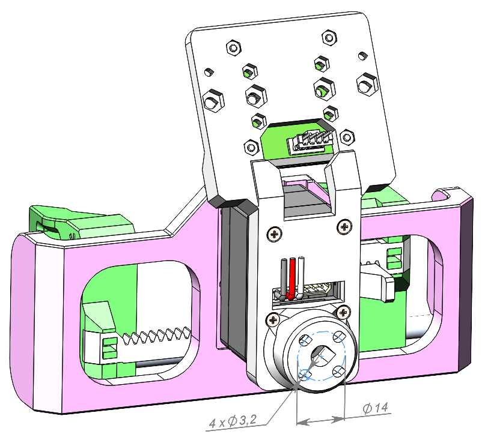

# SO ARM 100/101 Parallel Follower Gripper

## Overview

Lightweight 3D-printed end-effector designed by **Robonine Team** for the open-source teleoperating robotic platform SO ARM 100/101. The mechanism provides reliable parallel jaw motion and sufficient gripping force for a broad range of educational and experimental applications.

*Follower gripper mounted on SO-ARM100 robot arm*

## Key Features

- Open-source design
- BOM cost for one gripper: ~$62
- Can be printed during one cycle on a consumer-grade FDM 3D printer
- Compatible with popular video cameras:
  - Orbbec Gemini 2
  - RealSense D405, D435/D435i, D455
  - GC2093 2MP USB Camera Module
  - IMX335 5MP USB Camera

---

## Dimensions

### 3D Overview

*Isometric view showing overall dimensions: 128 × 109 × 130.5 mm, full stroke 84 mm*

| Dimension | Value |
|-----------|-------|
| Width | 128 mm |
| Depth | 130.5 mm |
| Height | 109 mm |
| Full stroke | 84 mm |

---

## Mounting Interface

*Mounting flange with hole pattern for robot arm attachment*

| Feature | Dimension |
|---------|-----------|
| Mounting flange diameter | Ø20 mm |
| Center bore | Ø7 mm |
| Mounting holes | 4x Ø3.2 mm |

---

## Gripper Parameters

| Parameter | Follower Gripper |
|-----------|------------------|
| Assembly mass (PLA, 30% infill) | 170 g |
| Maximum gripping force | 120 N |
| Maximum gripping speed | 14 mm/s |
| Full stroke | 84 mm |
| Repeatability | 0.5 mm |
| DOF | 1 |

---

## Technical Specifications

### Materials & Construction

| Component | Specification |
|-----------|---------------|
| Primary material | PETG / PLA |
| Transmission | Rack and pinion |
| Guides | Round aluminium/carbon tubes (Ø6 mm) |
| Driver | Feetech servo actuator STS3215 |

### Servo Parameters (Feetech STS3215)

| Parameter | Value |
|-----------|-------|
| Operating Voltage Range | 12V |
| Speed (no load) | 45 RPM |
| Running current (no load) | 180 mA |
| Stall torque (at locked) | 30 kg·cm |
| Stall current (at locked) | 2.7 A |
| Idle current (at stopped) | 30 mA |
| Rated torque | 10 kg·cm |
| Rated current | 900 mA |
| Terminal resistance | 1 Ω |
| Operating temperature | -20°C ~ 60°C |
| Encoder type | Absolute magnetic 12-bit |
| Control protocol | RS485/TTL up to 1 Mbps |
| Electronic protection | Against high voltage, current, load, and temperature |

---

## Camera Compatibility

The Follower gripper is compatible with various cameras via interchangeable camera holder.

*Different cameras mounted on gripper (left to right): RealSense, USB camera module, Orbbec Gemini 2*

### Supported Cameras

| Camera | Type | Notes |
|--------|------|-------|
| IMX335 5MP USB | RGB | Compact, low-cost |
| GC2093 2MP USB | RGB | Budget option |
| Orbbec Gemini 2 | RGB-D | Depth sensing |
| RealSense D405 | RGB-D | Close-range depth |
| RealSense D435/D435i | RGB-D | General purpose |
| RealSense D455 | RGB-D | Long-range depth |

---

## Supplied Resources

- Complete set of STL files for 3D printing
- Assembly guide
- Drawings with mounting dimensions
- URDF file for robotic simulators

---

## Integration

The gripper can be independently integrated into numerous robotic systems thanks to its convenient and simple installation via the standard mounting flange.

### Mounting Requirements

- 4x M3 screws for flange attachment
- Compatible with SO-ARM100/101 robot arm
- Custom adapter plates available for other robot arms

### Communication

- Serial connection via TTL or RS485
- Baud rate: Up to 1 Mbps
- Protocol: Feetech STS protocol

---

## Product Specification Documents

- [Parallel Gripper Product Specification (PDF)](Parallel%20gripper%20by%20Robo9.pdf) — Full product specification for the parallel gripper by Robo9
- [SO-ARM101 Product Specification (PDF)](SO-ARM101%20by%20Robo9.pdf) — Full product specification for the SO-ARM101 robot arm by Robo9

---

*Specifications subject to change based on actual implementation and testing*
